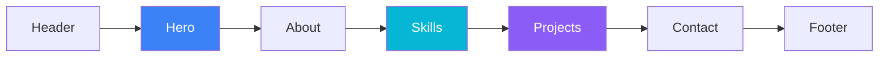

<div align="center">


# Wiles's Base

**个人作品集 · 单页展示 · 轻量现代**

[](LICENSE)
[](https://react.dev/)
[](https://www.typescriptlang.org/)
[](https://vite.dev/)
[](https://tailwindcss.com/)

[📦 快速开始](#-快速开始) · [🛠 自定义内容](#-自定义内容) · [🤝 贡献](#-贡献)

---

*用 React、TypeScript 与 Tailwind CSS 构建的单页作品集，展示简介、技能、项目与联系方式。*

</div>

<br />

## 📑 目录

- [✨ 特性](#-特性)
- [🧱 技术栈](#-技术栈)
- [🚀 快速开始](#-快速开始)
- [📁 项目结构](#-项目结构)
- [🛠 自定义内容](#-自定义内容)
- [📜 脚本命令](#-脚本命令)
- [🔗 相关链接](#-相关链接)
- [📄 License](#-license)

---

## ✨ 特性

<table>
<tr>
<td width="50%">

### 🏠 单页布局
首页 · 关于我 · 技能 · 项目 · 联系方式，顶栏平滑滚动直达各区块。

### 🎬 滚动动画
自定义 `useIntersectionObserver`，向下滚动时区块淡入，向上滚动时优雅退出。

</td>
<td width="50%">

### 🎯 技能筛选
前端 / 后端 / 工具分类切换，卡片展示熟练度与 SVG 图标。

### 📬 便捷联系
项目卡片链向 GitHub；邮箱一键复制，Toast 即时反馈。

</td>
</tr>
</table>

---

## 🧱 技术栈

| 类别 | 技术 |
|:---:|:---|
| ⚛️ 框架 | React 19 · TypeScript |
| ⚡ 构建 | Vite 7 · ESLint |
| 🎨 样式 | Tailwind CSS 3 · 自定义 CSS 动画 |
| 📦 架构 | 数据驱动（`projects.ts` / `skills.ts`）· 零路由依赖 |



---

## 🚀 快速开始

> 💡 需要 **Node.js 18+**（建议 20+）

```bash
# 1️⃣ 克隆仓库
git clone https://github.com/DevWiles/base-of-wiles.git
cd base-of-wiles

# 2️⃣ 安装依赖
npm install

# 3️⃣ 启动开发服务器 → http://localhost:5173
npm run dev
```

<details>
<summary><b>📦 构建与部署</b></summary>

<br />

```bash
npm run build    # 类型检查 + 生产构建 → dist/
npm run preview  # 本地预览构建产物
npm run lint     # ESLint 代码检查
```

构建产物位于 `dist/`，可部署至 **GitHub Pages** · **Vercel** · **Netlify** 等静态托管平台。

</details>

---

## 📁 项目结构

```
base-of-wiles/
├── 📂 public/              # 仅固定 URL 静态文件（favicon、resume.pdf）
├── 📂 src/
│   ├── 🧩 components/      # Header · Hero · About · Skills · Projects · Contact · Footer
│   ├── 📊 data/            # projects.ts · skills.ts
│   ├── 🪝 hooks/           # useIntersectionObserver.ts
│   ├── 🖼 assets/
│   │   ├── images/         # about/ · projects/（封面、头像等位图）
│   │   └── icons/          # contact/ · skills/（SVG 图标）
│   ├── 🎨 index.css        # Tailwind + 动画 keyframes
│   └── 📄 App.tsx          # 页面组装与平滑滚动
└── 📂 docs/plans/          # 滚动动画设计文档
```

---

## 🛠 自定义内容

### 📌 添加项目

编辑 [`src/data/projects.ts`](src/data/projects.ts)，封面图放入 `src/assets/images/projects/` 并在 [`index.ts`](src/assets/images/projects/index.ts) 中导出：

| 字段 | 说明 |
|:---|:---|
| `title` | 项目名称 |
| `description` | 简短描述 |
| `techStack` | 技术标签数组 |
| `imageUrl` | 封面图（从 `assets/images/projects` 导入） |
| `link` | GitHub 或项目地址 |

### 🎯 调整技能

编辑 [`src/data/skills.ts`](src/data/skills.ts)。展示顺序与图标映射见 [`src/components/Skills.tsx`](src/components/Skills.tsx) 中的 `skillOrder` 与 `skillIcons`。

### 🖼 其他资源

| 资源 | 路径 |
|:---|:---|
| 个人头像 | `src/assets/images/about/profile.jpg` |
| 项目封面 | `src/assets/images/projects/` |
| 联系/技能图标 | `src/assets/icons/contact/` · `src/assets/icons/skills/` |
| PDF 简历 | `public/resume.pdf` |
| 站点 favicon | `public/wiles.svg` |

---

## 📜 脚本命令

| 命令 | 说明 |
|:---|:---|
| `npm run dev` | 🔥 开发服务器，支持 HMR |
| `npm run build` | 🏗 `tsc -b` + `vite build` |
| `npm run preview` | 👀 本地预览生产构建 |
| `npm run lint` | ✅ ESLint 检查 |

---

## 🤝 贡献

欢迎提交 Issue 或 Pull Request！

1. Fork 本仓库
2. 创建特性分支：`git checkout -b feat/your-feature`
3. 提交改动并推送
4. 发起 Pull Request

---

## 🔗 相关链接

[](https://github.com/DevWiles)
[](https://github.com/DevWiles/base-of-wiles)

---

## 📄 License

本项目基于 [MIT License](LICENSE) 开源。

<div align="center">

<br />

**⭐ 如果这个项目对你有帮助，欢迎 Star 支持一下！**

Made with ❤️ by [Wiles](https://github.com/DevWiles)

</div>
